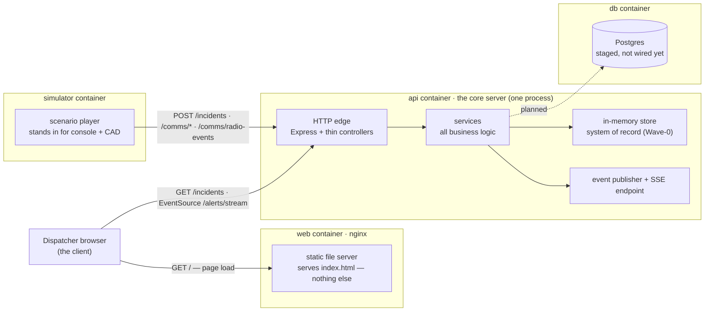
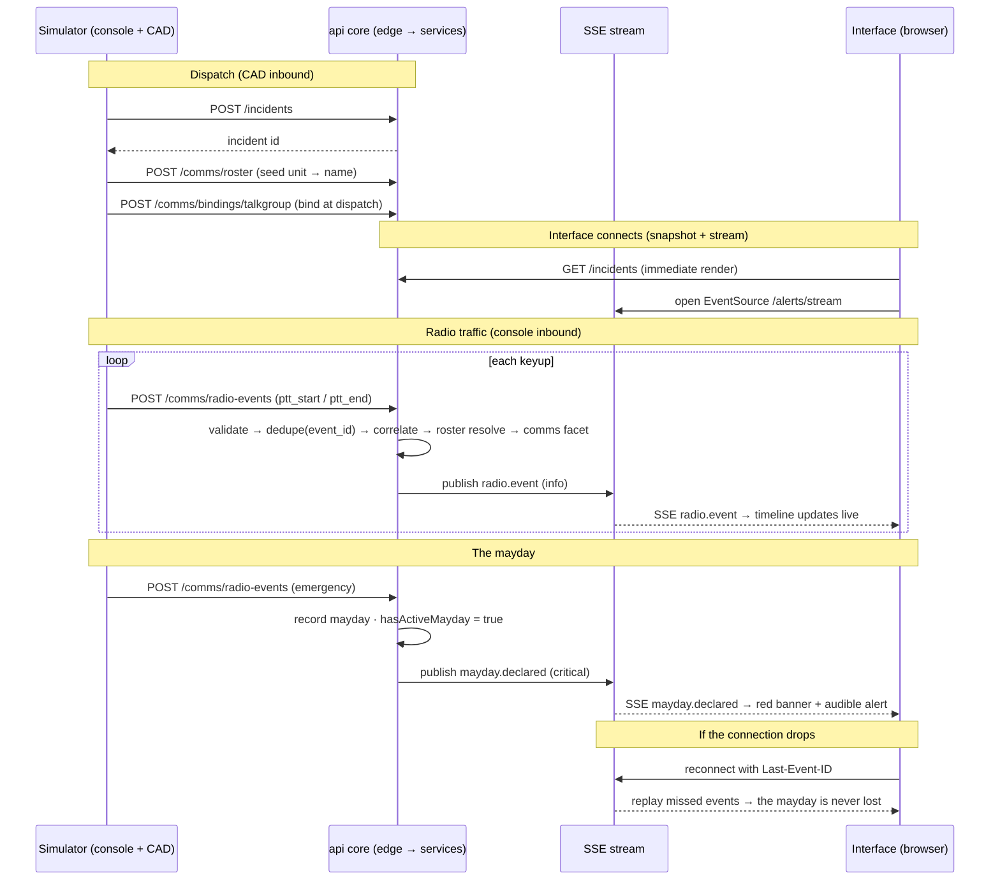
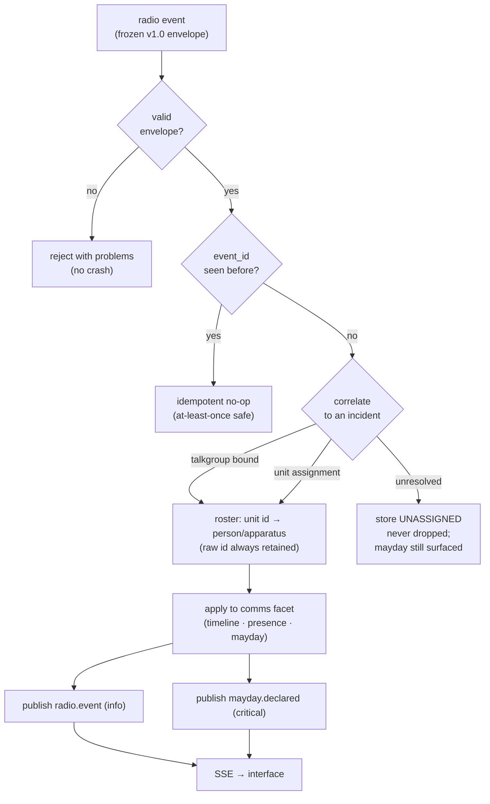

# The virtual system — how the demo fits together

This is the self-contained `docker compose` demo: staged events flow into the core,
get correlated onto an incident, and stream out to a live web view — a whole fire
department in a box, with no real radios, credentials, or NERIS account. It exists so
you can see the entire chain work end-to-end and then break individual pieces against a
system that already loops.

Everything below was verified against a running server: dispatch → roster resolution →
correlation → comms-facet timeline (including a dropped-radio transmission left open) →
live SSE out including a `mayday.declared` → reconnect replay via `Last-Event-ID`.

## Container topology

Four containers. They share no memory and no code — **every boundary between them is a
plain HTTP call** (with SSE, the live push, being just a long-lived HTTP response).

**The point about the web server (nginx):** it only *serves the page*. It is **not** in
the data path. Once the browser has `index.html`, the page's JavaScript talks **directly
to the api** over HTTP for the snapshot and opens the SSE stream to the api itself (the
api sends permissive CORS in Wave-0). So the web server is a dumb, fully-separable static
host; swap it for any static host — or open the file directly — and nothing else changes.
The display data always comes from the browser↔api conversation, never from nginx.

## Inside the core: thin edge over the logic

The api container is one process, but layered so the HTTP transport is separable from the
logic:

- **HTTP edge** — Express (the actual HTTP server) plus thin NestJS controllers. They only
  translate HTTP ⇄ service calls. Express is a swappable transport adapter (could be
  Fastify) with zero logic in it.
- **services** — where everything real happens: ingest/validate/dedupe, correlation,
  roster resolution, the comms-facet timeline, submission state machine. Tests drive these
  directly, no HTTP involved — which is the proof the logic is decoupled from the edge.
- **event publisher + SSE** — the outbound seam (ADR-0002): domain events with a monotonic
  id, a live stream, and a replay buffer for reconnect.

The separation that matters for longevity is **api-versus-clients**, and that is a hard
boundary: the browser and the simulator are both just clients.

## End-to-end flow: a mayday, front to back

## The ingest pipeline (what happens inside `services` per event)

## What the demo proves — and what it doesn't

**Proven, end-to-end:** the full inbound → core → outbound → interface loop; correlation
and roster resolution; the drop-tolerant timeline (a transmission with no end stays open,
then auto-closes on a silence timeout); at-least-once ingest with dedupe on `event_id`;
live SSE delivery; and reconnect replay so a mayday is never lost.

**Not yet (deliberately, Wave-0):** storage is in-memory (restart = clean slate; the `db`
container is staged for the Postgres step), there is no auth on the stream yet
(ADR-0002 action item), and transport is HTTP/SSE only — the durable-stream binding
(NATS/Redis) arrives with multi-node.

See [DEMO.md](./DEMO.md) to run it, and [ADR-0003](./adr/ADR-0003-swappable-component-rig.md)
for the plan to swap these fake components for real ones (including real radio hardware).
