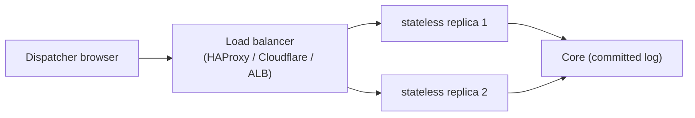

# Load balancing & deployment: stateless services

How to run the stateless services (urgent delivery, the APIs, the general stream) behind a
load balancer. Design basis: [ADR-0004](../adr/ADR-0004-recording-core-read-model-ha-topology.md).

> **Status:** target architecture. Today the repo runs the collapsed demo
> ([DEMO.md](../DEMO.md)); the multi-replica + LB topology below is where it's headed. The
> **local-only** path works now; the **hosting-provider** paths are the deployment plan.

## What is (and isn't) balanced

Two different things, don't conflate them:

- **Stateless services** — urgent delivery, stable/regular/experimental APIs, the general
  live-stream. These scale horizontally: run **≥ 2 replicas** and put **any** load balancer
  in front. No session affinity — a dropped client reconnects to any replica and replays
  via `Last-Event-ID`. This doc is about these.
- **The Core (Postgres/Patroni)** — *not* round-robin balanced. Writes go to the one
  current primary; reads may spread to standbys. That's **primary-aware routing** (HAProxy
  reading Patroni's health endpoints, or a VIP), covered with the Core, not here.

## The LB contract (any load balancer must satisfy this)

The system depends on no specific LB. Whatever you put in front must:

1. **Treat replicas as interchangeable** — no sticky sessions required.
2. **Probe health** — a readiness endpoint decides "in rotation or not."
3. **Drain gracefully** — when a replica goes not-ready, stop new connections and let it
   close open streams; clients reconnect elsewhere.
4. **Forward client identity** — pass `X-Forwarded-For` / `X-Forwarded-Proto`.
5. **Not break SSE** — **no response buffering**, and an **idle timeout longer than the
   15s heartbeat**. Prefer **least-connections** for the long-lived stream services.

Any LB that honors those five works: local HAProxy, a cloud ALB, Cloudflare, `cloudflared`.

---

## 1. Local-only setup

### Simplest — one container, no LB

For a developer or a curious firefighter: run everything collapsed, no load balancer at
all. This is the demo today.

```bash
docker compose up --build      # see DEMO.md; open http://localhost:8080
```

One replica of each service, no balancing needed. Use this to develop and to understand
the system.

### Local, realistic — 2 replicas behind HAProxy

To exercise the real shape on one machine, scale a stateless service to 2 and front it with
HAProxy. Illustrative `haproxy.cfg` for the urgent/stream service:

```
frontend fe_stream
    bind *:8080
    default_backend be_stream

backend be_stream
    balance leastconn                 # long-lived SSE: least-connections, not round-robin
    option httpchk GET /api/v1/health/ready
    # no 'http-buffer-request'; do not buffer the streaming response
    timeout tunnel 1h                 # allow long-lived SSE connections
    server s1 stream1:3000 check
    server s2 stream2:3000 check
```

Key bits: `leastconn`, a **readiness** health check, a long `timeout tunnel` for SSE, and
no buffering. The app must expose `/api/v1/health/ready` and drain on shutdown.

---

## 2. Hosting-provider setup

### Generic (the contract, provider-agnostic)

The pattern is the same everywhere, and this is the version to reach for first:

1. Deploy **≥ 2 replicas** of the stateless service (containers, VMs, or a `cloudflared`
   fleet — see below).
2. Put a load balancer in front with the replicas as **origins/backends**.
3. Point its **health check** at `/api/v1/health/ready`.
4. Turn **off** session affinity/sticky sessions.
5. Set **least-connections** (or equivalent) and an **idle/read timeout > 15s**; ensure
   **response buffering is off** so SSE streams flush immediately.
6. Route the public hostname at the LB; the app never needs to know its public address.

Every provider does the mechanics a little differently, but if the six steps above are met,
the deployment is correct. The provider notes below are just examples of the same thing.



### Cloudflare option A — `cloudflared` tunnel (HA, multi-replica)

The model tested in a homelab: run **one `cloudflared` per host**, all using the **same
named tunnel**; Cloudflare balances incoming requests across the connected replicas on
their edge. No public IP or open inbound port on your side.

- On each host, run the service **and** a `cloudflared` pointing at the local service:
  ```yaml
  # ~/.cloudflared/config.yml (per host)
  tunnel: open-emergency-stream
  credentials-file: /etc/cloudflared/<tunnel-id>.json
  ingress:
    - hostname: alerts.example.org
      service: http://localhost:3000
    - service: http_status:404
  ```
- Start the same tunnel on host 2 (and 3…). Cloudflare sees multiple connections for one
  tunnel and load-balances across them — the HA behavior you tested.
- Works with SSE because our heartbeat (15s) keeps the connection under Cloudflare's idle
  timeout, and the service is stateless so any replica can serve any reconnect.
- Recovery: if a host drops, Cloudflare routes to the remaining connections; the client's
  `EventSource` reconnects and replays. Bring the host back and its `cloudflared` rejoins.

Best when you're self-hosting (homelab, on-prem at a station) and want no inbound ports.

### Cloudflare option B — separate Cloudflare Load Balancer

When the replicas have reachable origins (e.g. VMs with public or tunneled endpoints), use
Cloudflare's **Load Balancer** product instead of (or with) tunnels:

- Create a **pool** with your replica origins.
- Health check → `/api/v1/health/ready`.
- **Session affinity: off.**
- Front it with the public hostname; Cloudflare steer/failover across origins.
- SSE: ensure the response isn't cached/buffered (it won't be for `text/event-stream`); the
  heartbeat keeps it under edge idle limits.

Use this when you want Cloudflare's geo-steering / failover across data centers.

### Other providers (same contract)

A cloud ALB/NLB, nginx, or Traefik all work identically: origins = replicas, health check =
`/ready`, affinity off, no buffering, idle timeout > heartbeat, least-connections for
streams. If a provider can't disable response buffering on a route, don't put the SSE
stream behind it — put the stream service on a provider/route that can.

## Gotchas (read before you ship)

- **Buffering breaks SSE.** A proxy that buffers turns a live stream into bursts. Verify
  the `text/event-stream` route flushes immediately.
- **Idle timeouts kill idle streams.** Our 15s heartbeat covers common defaults; if a
  provider's timeout is shorter, lower the heartbeat, don't raise it past the timeout.
- **Sticky sessions are unnecessary and can hurt** (uneven load, worse failover). Leave
  affinity off — the design doesn't need it.
- **Health check the readiness endpoint, not liveness** — liveness says "process alive,"
  readiness says "ready to serve"; the LB wants the latter so draining works.
